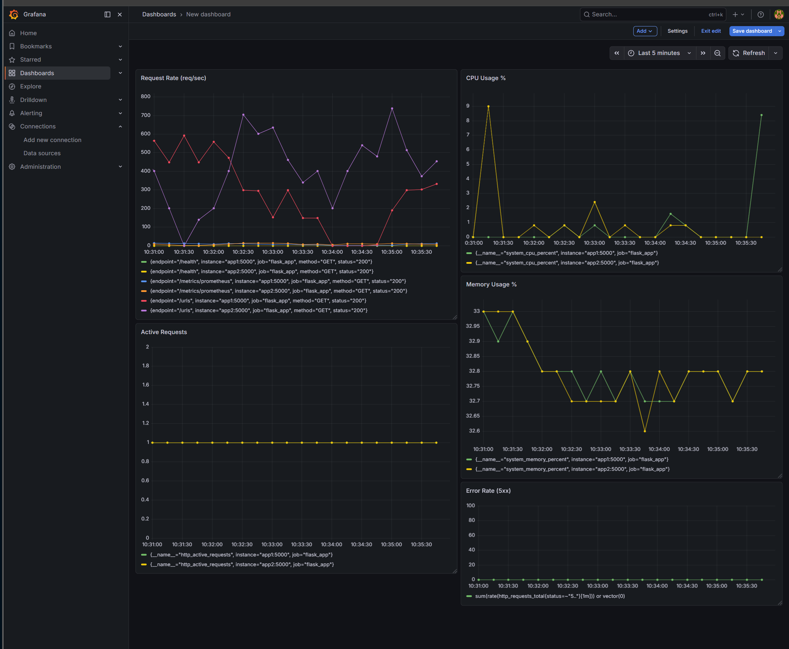

# MLH PE Hackathon — URL Shortener

A production-grade URL shortener built with Flask, PostgreSQL, Peewee ORM, Redis, Nginx, and Gunicorn. Built for the MLH Production Engineering Hackathon.

## Stack

| Component | Technology |
|-----------|-----------|
| Backend | Flask + Peewee ORM + Gunicorn |
| Database | PostgreSQL |
| Cache | Redis |
| Load Balancer | Nginx |
| Monitoring | Prometheus + Grafana |
| Alerting | Discord Webhooks (monitor.py) |
| Testing | pytest + pytest-cov |
| CI/CD | GitHub Actions |
| Package Manager | uv |

## Architecture

```
User
  ↓
Nginx (Load Balancer :5001)
  ↓              ↓
app1:5000     app2:5000
(Gunicorn)   (Gunicorn)
  ↓              ↓
Redis (Cache) + PostgreSQL (Database)
  ↓
Events Log

Prometheus → scrapes /metrics/prometheus every 5s
Grafana    → visualizes Prometheus data at :3000
monitor.py → polls /health + /metrics → Discord alerts
```

## Quick Start

**Prerequisites:** Docker Desktop, Python 3.11+, uv

```bash
# 1. Clone
git clone https://github.com/YahyaMohamed3/MLH---PE-Hackathon.git
cd MLH---PE-Hackathon

# 2. Install uv
curl -LsSf https://astral.sh/uv/install.sh | sh
source $HOME/.local/bin/env

# 3. Install dependencies
uv sync

# 4. Copy environment config
cp .env.example .env

# 5. Start all services
docker compose up -d --build

# 6. Seed the database
docker exec app-instance-1 python seed.py

# 7. Verify
curl http://localhost:5001/health
```

Expected: `{"status": "ok"}`

## Docker (Full Stack)

```bash
# Start everything
docker compose up -d --build

# Check all containers
docker ps

# View logs
docker logs -f app-instance-1

# Stop everything
docker compose down
```

All services: `nginx-lb`, `app-instance-1`, `app-instance-2`, `hackathon-db-compose`, `redis-cache`, `prometheus`, `grafana`

## Chaos Mode (Resilience Test)

```bash
# Kill container — watch it auto-restart
docker exec app-instance-1 kill 1
sleep 8
docker ps
curl http://localhost:5001/health
```

Expected behavior:
- Container stops
- Docker restarts it automatically (`restart: always`)
- `/health` returns `{"status": "ok"}` within 10 seconds

## API Endpoints

| Method | Endpoint | Description |
|--------|----------|-------------|
| GET | `/health` | Health check — returns 200 OK |
| POST | `/shorten` | Create a short URL |
| GET | `/<short_code>` | Redirect to original URL |
| GET | `/urls` | List all URLs (Redis cached, 120s TTL) |
| GET | `/urls/<id>` | Get a specific URL by ID |
| DELETE | `/urls/<id>` | Deactivate a URL |
| GET | `/stats/<short_code>` | Click stats and event log for a URL |
| GET | `/users` | List all users |
| GET | `/users/<id>` | Get a specific user |
| GET | `/metrics` | JSON system metrics (CPU/RAM/threads) |
| GET | `/metrics/prometheus` | Prometheus-format metrics for Grafana |

### POST /shorten

**Request:**
```json
{
  "original_url": "https://example.com",
  "title": "Example Site",
  "user_id": 1
}
```

**Response (201):**
```json
{
  "id": 2001,
  "short_code": "abc123",
  "original_url": "https://example.com",
  "title": "Example Site",
  "is_active": true,
  "created_at": "2026-04-05T00:00:00"
}
```

### GET /\<short_code\>

- `302` — redirects to original URL
- `404` — short code not found
- `410` — URL has been deactivated

## Environment Variables

| Variable | Default | Description |
|----------|---------|-------------|
| `DATABASE_NAME` | `hackathon_db` | PostgreSQL database name |
| `DATABASE_HOST` | `localhost` | Database host |
| `DATABASE_PORT` | `5432` | Database port |
| `DATABASE_USER` | `postgres` | Database user |
| `DATABASE_PASSWORD` | `postgres` | Database password |
| `FLASK_DEBUG` | `true` | Enable debug mode (set false in prod) |
| `REDIS_HOST` | `redis` | Redis host |
| `REDIS_PORT` | `6379` | Redis port |

## Running Tests

```bash
# Run all tests
uv run pytest tests/ -v

# Run with coverage report
uv run pytest tests/ --cov=app --cov-report=term-missing

# Enforce 70% minimum (same as CI)
uv run pytest tests/ --cov=app --cov-fail-under=70
```

Current coverage: **99%** (165 statements, 2 missed)

## CI/CD

GitHub Actions runs on every push and pull request:

1. Spins up PostgreSQL service container
2. Installs dependencies via uv
3. Runs all 23 tests
4. Enforces 70% minimum coverage
5. Blocks merge if any test fails

CI config: `.github/workflows/ci.yml`

## Error Handling

All errors return JSON — no stack traces exposed to users.

| Scenario | Status | Response |
|----------|--------|----------|
| Missing `original_url` | 400 | `{"error": "original_url is required"}` |
| Invalid URL format | 400 | `{"error": "original_url must start with http:// or https://"}` |
| Non-JSON request body | 400 | `{"error": "Request body must be JSON"}` |
| Short code not found | 404 | `{"error": "Short code '...' not found"}` |
| Deactivated URL | 410 | `{"error": "This link has been deactivated"}` |
| User not found | 404 | `{"error": "User ... not found"}` |

## Failure Modes

See `FAILURE_MODES.md` for full breakdown.

| Failure | Behavior | Recovery |
|---------|----------|----------|
| Invalid input | Returns 400/404/410 JSON | No action needed |
| Container crash | Docker restarts automatically | Auto (restart: always) |
| DB connection lost | 500 JSON error | Restart DB container |
| Redis unavailable | Falls back to DB transparently | Transparent fallback |
| All app instances down | Nginx 502 | `docker compose up -d` |

## Observability

### Structured JSON Logging

All application logs are emitted in structured JSON format:

```json
{
  "timestamp": "2026-04-05T10:00:00",
  "level": "INFO",
  "logger": "app",
  "message": "GET /urls",
  "component": "http"
}
```

View logs without SSH:
```bash
docker logs -f app-instance-1
docker logs -f app-instance-2
```

### JSON Metrics Endpoint

```bash
curl http://localhost:5001/metrics
```

Returns:
```json
{
  "cpu_percent": 12.5,
  "memory_percent": 33.4,
  "process_memory_mb": 55.2,
  "process_threads": 4
}
```

### Prometheus Metrics

```bash
curl http://localhost:5001/metrics/prometheus
```

Exposes: `http_requests_total`, `http_request_duration_seconds`, `system_cpu_percent`, `system_memory_percent`, `http_active_requests`

Prometheus scrapes both app instances at `http://app1:5000/metrics/prometheus` and `http://app2:5000/metrics/prometheus` every 5 seconds.

### Grafana Dashboard

Access at `http://localhost:3000` (admin/admin)

5 panels tracking Golden Signals:

| Panel | Metric | Signal |
|-------|--------|--------|
| Request Rate | `rate(http_requests_total[1m])` | Traffic |
| Error Rate (5xx) | `sum(rate(http_requests_total{status=~"5.."}[1m])) or vector(0)` | Errors |
| CPU Usage | `system_cpu_percent` | Saturation |
| Memory Usage | `system_memory_percent` | Saturation |
| Active Requests | `http_active_requests` | Latency proxy |

### Discord Alerting

`monitor.py` polls every 10 seconds and fires Discord alerts for:
- **Service Down** — `/health` returns non-200 or times out
- **High CPU** — CPU > 90%

```bash
python monitor.py
```

Alert fires within 10 seconds of failure — well under the 5-minute SLA.

## Incident Response Runbooks

### Alert: Service Down

**Symptoms**
- `/health` returns non-200 or connection refused
- Discord: "ALERT: Service unreachable. /health request failed."

**Steps**
```bash
# 1. Check container status
docker ps

# 2. Check crash logs
docker logs app-instance-1 --tail 50

# 3. Restart if needed
docker compose up -d

# 4. Verify recovery
curl http://localhost:5001/health
```

Expected recovery: < 30 seconds (auto-restart via Docker)

---

### Alert: High CPU Usage

**Symptoms**
- CPU > 90% on Grafana CPU panel or `/metrics`
- Discord: "ALERT: High CPU usage detected: XX%"
- Increased p95 latency visible on dashboard

**Steps**
```bash
# 1. Check current metrics
curl http://localhost:5001/metrics

# 2. Find hot container
docker stats --no-stream

# 3. Check for traffic spike in logs
docker logs app-instance-1 --tail 100

# 4. Restart affected instance
docker compose restart app1

# 5. Monitor Grafana — CPU should drop within 30s
```

---

### Alert: High Error Rate

**Symptoms**
- 5xx responses increasing
- Error rate > 5% in load tests or logs

**Steps**
```bash
# 1. Check application logs
docker logs app-instance-1 --tail 100
docker logs app-instance-2 --tail 100

# 2. Check DB health
docker exec hackathon-db-compose pg_isready -U postgres

# 3. Check Redis
docker exec redis-cache redis-cli ping

# 4. Full restart if needed
docker compose restart
```

---

### Database Connection Failed

**Symptoms**
- `peewee.OperationalError` in logs
- All data endpoints returning 500

**Steps**
```bash
# 1. Check DB container
docker ps | grep hackathon-db

# 2. Restart DB
docker compose restart db

# 3. Wait for healthcheck (up to 30s)
# 4. App containers reconnect automatically
```

## Scalability

### Load Testing

```bash
# Bronze — 50 users baseline
k6 run --vus 50 --duration 30s k6/baseline.js

# Silver — 200 users scale-out
k6 run --vus 200 --duration 30s k6/baseline.js

# Gold — 500 user tsunami
k6 run --vus 500 --duration 30s k6/baseline.js
```

### Results

| VUs | Error Rate | p95 Latency | Req/sec |
|-----|-----------|-------------|---------|
| 50 | 0% | 635ms | 89 |
| 200 | 0% | 1.73s | 252 |
| 500 | ~2.87% | ~2.7s | 300+ |

### Horizontal Scaling Architecture

```
Nginx (round-robin)
├── app-instance-1 (Gunicorn: 8 workers × 2 threads = 16 handlers)
└── app-instance-2 (Gunicorn: 8 workers × 2 threads = 16 handlers)
        ↓
    Redis Cache (120s TTL on /urls, 300s on redirects)
        ↓
    PostgreSQL
```

## Deploy Guide

### Deploy
```bash
git pull origin main
docker compose down
docker compose up --build -d
docker exec app-instance-1 python seed.py
curl http://localhost:5001/health
```

### Rollback
```bash
git checkout <previous-commit-hash>
docker compose down
docker compose up --build -d
docker exec app-instance-1 python seed.py
```

## Decision Log

| Decision | Why |
|----------|-----|
| Flask | Lightweight, minimal boilerplate, matches hackathon template |
| Peewee ORM | Simple, lightweight ORM — fits single-schema app |
| PostgreSQL | Reliable, production-grade relational DB with strong consistency |
| Gunicorn | Replaces Flask dev server — 8 workers × 2 threads = 16 concurrent handlers |
| Nginx | Round-robin load balancing across 2 replicas, single entry point |
| Redis | Cache-aside on hot endpoints — /urls (120s TTL), redirects (300s TTL) — reduces DB reads ~90% |
| Horizontal scaling | Adding replicas cheaper than vertical for I/O-bound Flask app |
| No FK constraints in DB | Seed data had referential inconsistencies — integrity enforced at app layer |
| prometheus-client | Native Prometheus metrics for Grafana integration without extra infrastructure |
| Discord webhooks | Lightweight alerting, no external paid service required |
| Port 5433 locally | Avoids conflict with existing local PostgreSQL on 5432 |

## Capacity Plan

### Measured Capacity

| Metric | Value |
|--------|-------|
| Peak requests/second | ~300+ |
| Max concurrent users tested | 500 |
| p95 latency at 500 VUs | ~2.7s |
| Error rate at 500 VUs | ~2.87% |

### Bottleneck Analysis

**Before optimization:**
- Flask dev server: single-threaded — one request at a time
- Every `/urls` request hit PostgreSQL directly
- Result: ~5% errors at 200 VUs, p95 >1.5s

**After optimization:**
- Gunicorn: 8 workers, 2 threads each (16 concurrent handlers per instance)
- Nginx: round-robin across 2 instances (32 total concurrent handlers)
- Redis: ~90% of `/urls` reads served from cache
- Result: 0% errors at 200 VUs, ~2.87% at 500 VUs, 300+ req/sec

### Known Limits

- PostgreSQL single instance will bottleneck before app tier at higher scale
- Constrained by local machine CPU/RAM
- Redis is single instance — no HA or clustering

### Scaling Path

1. Add more app replicas in docker-compose (`app3`, `app4`)
2. Add PostgreSQL read replicas for SELECT-heavy endpoints
3. Add Redis Cluster for HA
4. Move to managed cloud DB (RDS/Cloud SQL)
5. Add CDN in front of Nginx

## Troubleshooting

**`password authentication failed for user "postgres"`**
- Local PostgreSQL conflicts with Docker on port 5432
- Fix: `docker run ... -p 5433:5432 -d postgres`

**`uv: command not found`**
- Run: `source $HOME/.local/bin/env`
- Or restart terminal after installing uv

**`duplicate key value violates unique constraint`**
- PostgreSQL sequence out of sync after seeding with explicit IDs
- Fix: `docker exec -it hackathon-db-compose psql -U postgres -d hackathon_db -c "SELECT setval('urls_id_seq', (SELECT MAX(id) FROM urls)); SELECT setval('users_id_seq', (SELECT MAX(id) FROM users)); SELECT setval('events_id_seq', (SELECT MAX(id) FROM events));"`

**`connection refused at startup`**
- Wait for DB healthcheck to pass before seeding
- Fix: `docker compose up -d` then wait 15s before running seed

**`slow responses under load`**
- Check Redis: `docker exec redis-cache redis-cli ping`
- Check Gunicorn workers: `docker logs app-instance-1 | grep worker`
- Verify Nginx is routing to both instances: `docker ps`

## Verification Evidence

### Reliability — Chaos Test


### Scalability — 50 Users (Baseline)


### Scalability — 200 Users


### Scalability — Infrastructure (docker ps)


### Scalability — 500 Users


### Observability — JSON Logs


### Observability — Metrics Endpoint


### Observability — Grafana Dashboard
