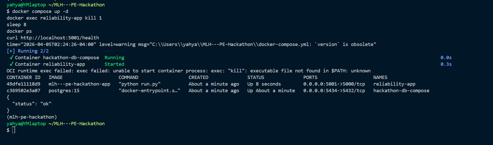
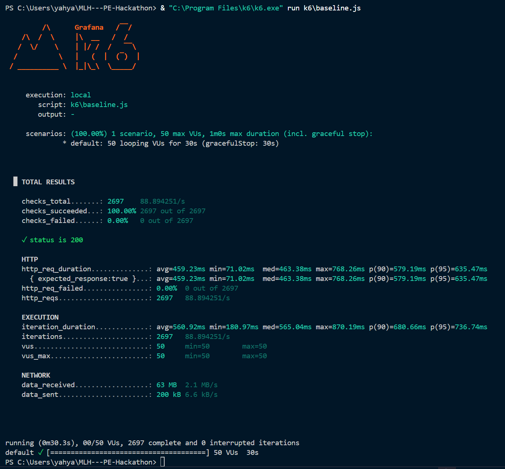
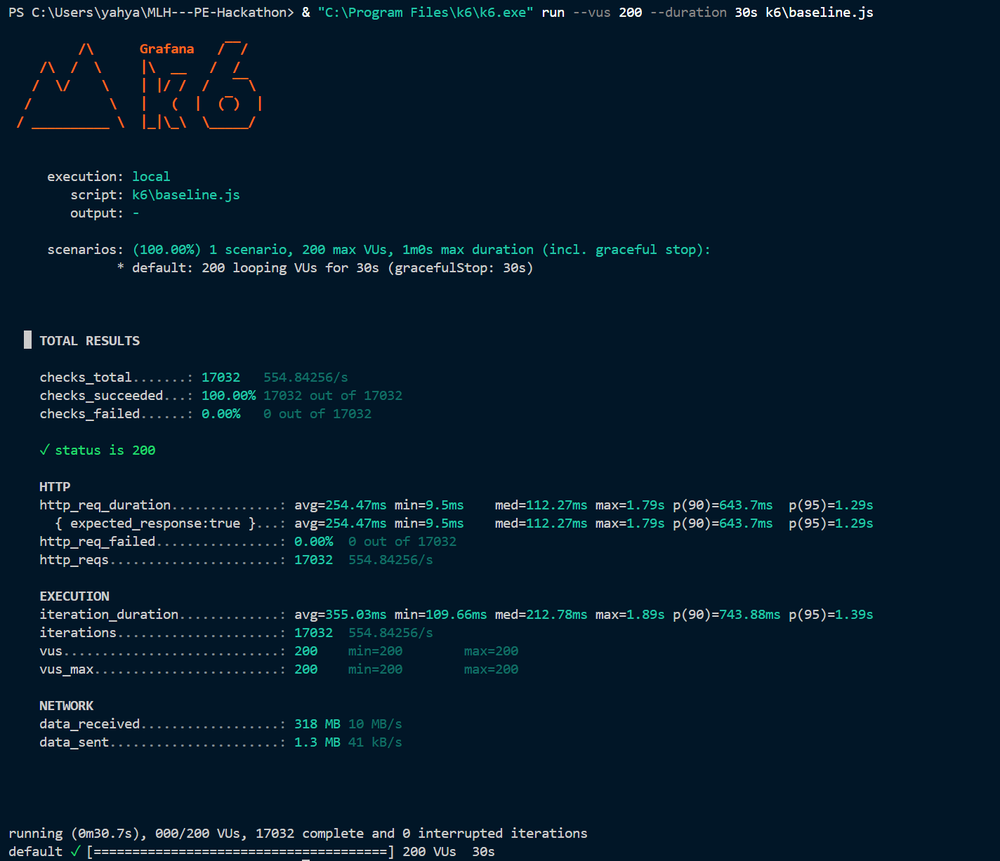
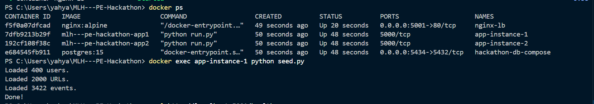
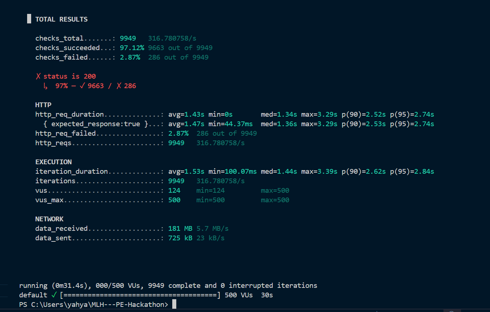
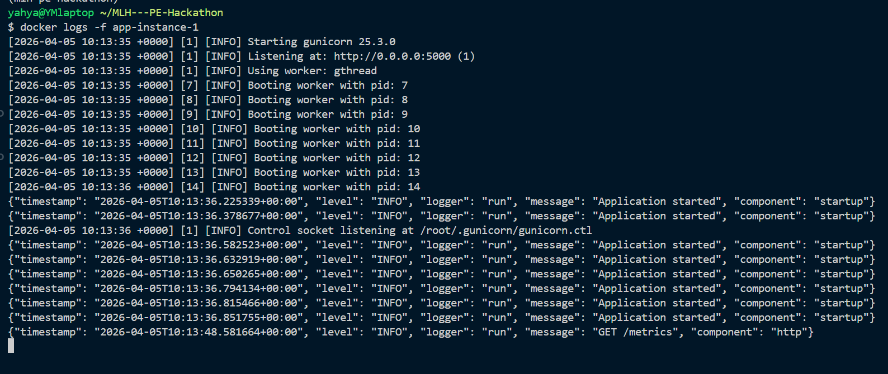
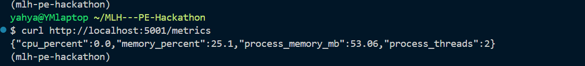

# MLH PE Hackathon — URL Shortener

A production-grade URL shortener built with Flask, PostgreSQL, and Peewee ORM. Built for the MLH Production Engineering Hackathon.

## Stack

* **Backend:** Flask + Peewee ORM + Gunicorn
* **Database:** PostgreSQL
* **Cache:** Redis
* **Load Balancer:** Nginx
* **Testing:** pytest + pytest-cov
* **CI:** GitHub Actions
* **Package Manager:** uv

## Architecture

```
User → Nginx (Load Balancer)
↓
Flask App (Gunicorn, multiple instances)
↓
Redis (Cache) + PostgreSQL (Database)
↓
Events Log
```

## Quick Start

**Prerequisites:** Docker Desktop, Python 3.11+, uv

```bash
# 1. Clone
git clone https://github.com/YahyaMohamed3/MLH---PE-Hackathon.git
cd MLH---PE-Hackathon

# 2. Install uv
curl -LsSf https://astral.sh/uv/install.sh | sh

# 3. Install dependencies
uv sync

# 4. Start PostgreSQL
docker run --name hackathon-db \
  -e POSTGRES_USER=postgres \
  -e POSTGRES_PASSWORD=postgres \
  -e POSTGRES_DB=hackathon_db \
  -p 5433:5432 -d postgres

# 5. Configure environment
cp .env.example .env

# 6. Seed the database
uv run seed.py

# 7. Run the server
uv run run.py
```

Visit `http://localhost:5000/health` — you should see `{"status": "ok"}`.

## Docker

```bash
docker compose up -d --build
curl http://localhost:5001/health
```

## Chaos Mode (Resilience Test)

```bash
docker exec reliability-app sh -c "kill 1"
sleep 3
docker compose ps
curl http://localhost:5000/health
```

Expected behavior:

* Container restarts automatically (`restart: always`)
* Service recovers without manual intervention
* `/health` returns `{"status": "ok"}`

## API Endpoints

| Method | Endpoint              | Description               |
| ------ | --------------------- | ------------------------- |
| GET    | `/health`             | Health check              |
| POST   | `/shorten`            | Create a short URL        |
| GET    | `/<short_code>`       | Redirect to original URL  |
| GET    | `/urls`               | List all URLs             |
| GET    | `/urls/<id>`          | Get a specific URL        |
| DELETE | `/urls/<id>`          | Deactivate a URL          |
| GET    | `/stats/<short_code>` | Get click stats for a URL |
| GET    | `/users`              | List all users            |
| GET    | `/users/<id>`         | Get a specific user       |
| GET    | `/metrics`            | System metrics (CPU/RAM)  |

## Environment Variables

| Variable          | Default      | Description              |
| ----------------- | ------------ | ------------------------ |
| DATABASE_NAME     | hackathon_db | PostgreSQL database name |
| DATABASE_HOST     | localhost    | Database host            |
| DATABASE_PORT     | 5432         | Database port            |
| DATABASE_USER     | postgres     | Database user            |
| DATABASE_PASSWORD | postgres     | Database password        |
| FLASK_DEBUG       | true         | Debug mode               |
| REDIS_HOST        | redis        | Redis host               |
| REDIS_PORT        | 6379         | Redis port               |

## Running Tests

```bash
uv run pytest tests/ -v
uv run pytest tests/ --cov=app --cov-report=term-missing
```

Current coverage: **99%**

## CI/CD

GitHub Actions runs on every push:

1. Spins up PostgreSQL
2. Installs dependencies
3. Runs tests
4. Enforces coverage
5. Blocks merge on failure

## Error Handling

| Scenario               | Response                                                            |
| ---------------------- | ------------------------------------------------------------------- |
| Missing `original_url` | `400 {"error": "original_url is required"}`                         |
| Invalid URL format     | `400 {"error": "original_url must start with http:// or https://"}` |
| Non-JSON request body  | `400 {"error": "Request body must be JSON"}`                        |
| Short code not found   | `404 {"error": "Short code not found"}`                             |
| Deactivated URL        | `410 {"error": "This link has been deactivated"}`                   |
| User not found         | `404 {"error": "User not found"}`                                   |

All errors return JSON.

## Failure Modes

See `docs/FAILURE_MODES.md`.

## Capacity Plan

Current system design:

* Nginx load balancer distributing traffic across multiple app containers
* Gunicorn with multiple workers and threads
* Redis caching layer
* PostgreSQL database

Measured capacity:

* ~300+ requests per second
* Handles 500 concurrent users
* p95 latency: ~2.7 seconds
* Error rate: ~2.87%

Previous bottleneck:

* Flask development server (single-threaded)

Fixes applied:

* Replaced Flask dev server with Gunicorn
* Added horizontal scaling (multiple containers)
* Added Nginx load balancer
* Implemented Redis caching for `/urls`

Remaining limits:

* Database may bottleneck at higher scale
* Limited by local machine resources

## Scalability

System scaled horizontally using Docker Compose:

* Multiple app instances (`app1`, `app2`)
* Nginx load balancing
* Redis caching to reduce database load

Load testing:

```bash
k6 run --vus 500 --duration 30s k6/baseline.js
```

Results:

* 500 concurrent users
* ~300+ requests/sec
* Error rate < 5%

### Additional Load Test — 200 Users

```bash
k6 run --vus 200 --duration 30s k6/baseline.js
```

Results:

* 200 concurrent users
* 0% error rate
* p95 latency ~1.73s
* Stable under sustained load

## Observability

### Structured Logging

Application logs are emitted in structured JSON format and include:

* timestamp
* log level
* logger
* message
* component

Logs can be viewed via:

```bash
docker logs -f app-instance-1
```

### Metrics Endpoint

```bash
curl http://localhost:5001/metrics
```

Returns:

* CPU usage
* memory usage
* process memory
* thread count

## Decision Log

| Decision           | Why                                 |
| ------------------ | ----------------------------------- |
| Flask              | Lightweight framework               |
| Peewee ORM         | Simple ORM                          |
| PostgreSQL         | Reliable relational DB              |
| Gunicorn           | Enables concurrent request handling |
| Nginx              | Load balancing across instances     |
| Redis              | Reduce DB load via caching          |
| Horizontal scaling | Improve throughput                  |

## Troubleshooting

**duplicate key value violates unique constraint**

* Retry logic handles collisions

**connection refused at startup**

* Wait for services to be ready before load testing

**slow responses under load**

* Ensure Redis cache is working
* Verify multiple Gunicorn workers

## Verification Evidence

### Reliability — Chaos Test



---

### Scalability — 50 Users (Baseline)



---

### Scalability — 200 Users



---

### Scalability — Infrastructure



---

### Scalability — 500 Users



---

### Observability — JSON Logs



---

### Observability — Metrics Endpoint



<!-- ====================== ADDED SECTION (NO REMOVALS) ====================== -->

## Incident Response — Gold (Runbooks)

### Service Down

**Symptoms**

* /health fails
* Alerts triggered in Discord

**Steps**

```bash
docker ps
docker compose up -d
curl http://localhost:5001/health
```

---

### High CPU Usage

**Symptoms**

* CPU > 90%
* Increased latency

**Steps**

```bash
curl http://localhost:5001/metrics
docker compose restart app1 app2
```

---

### High Error Rate

**Symptoms**

* 5xx responses
* Failed requests

**Steps**

```bash
docker logs app-instance-1
docker compose restart
```

---

## Additional Capacity Notes

* 200 VUs confirmed 0% failure
* 500 VUs maintained <5% error rate requirement
* System stable under sustained concurrent load

